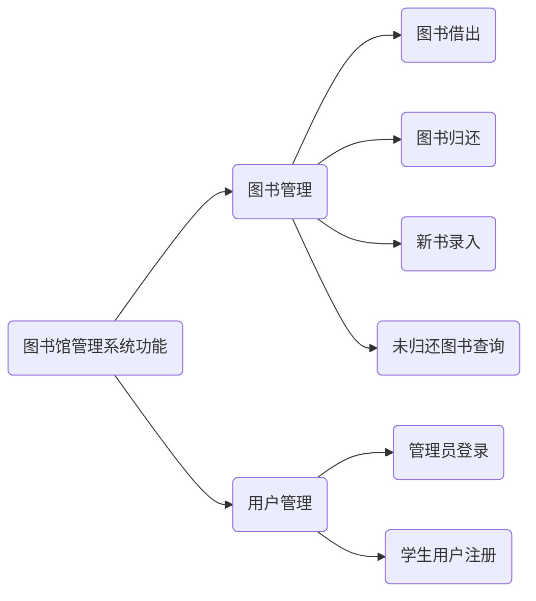
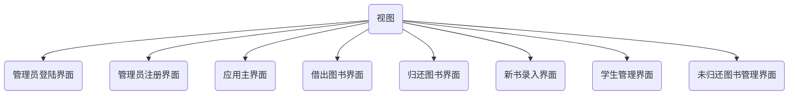
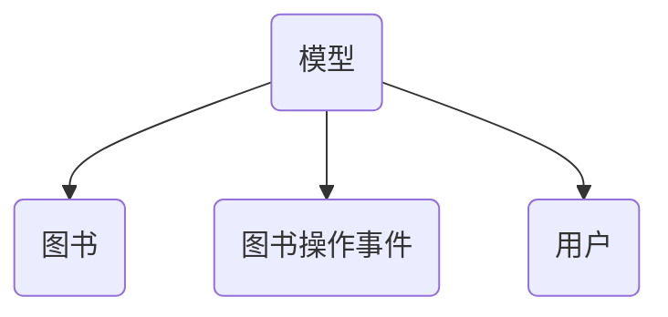
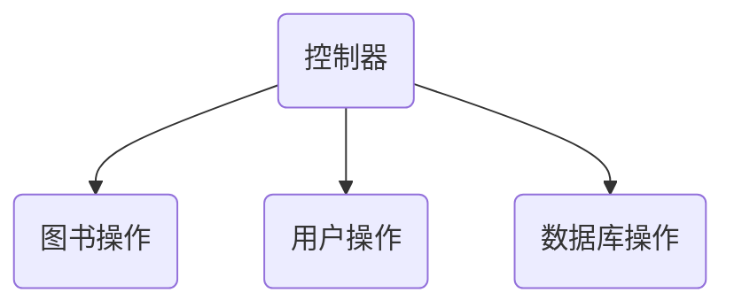

# 图书馆管理系统

## 1. 需求分析

## 2. 系统设计

### 图书馆应用结构设计

### 数据库表设计

- 管理员信息-`adminInfo`
- 学生信息-`stuInfo`
- 图书信息-`bookInfo`
- 图书操作信息记录-`bookLog`
- 未归还图书-`outSideBook`

## 3. 注意事项

创建一个Linux虚拟机，或购买一台云服务器。安装好==MongoDB==，保持开启状态。**关闭防火墙。**

